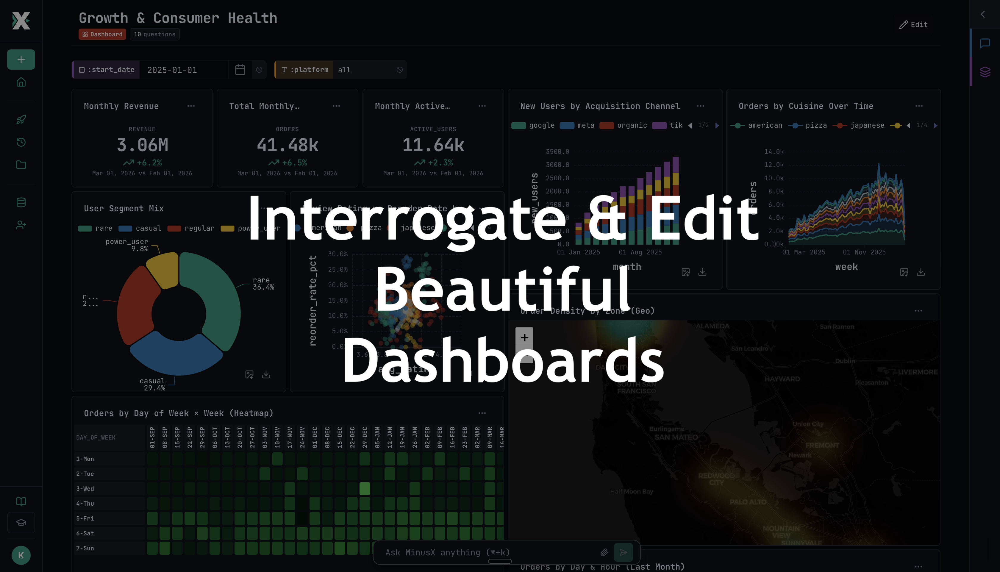
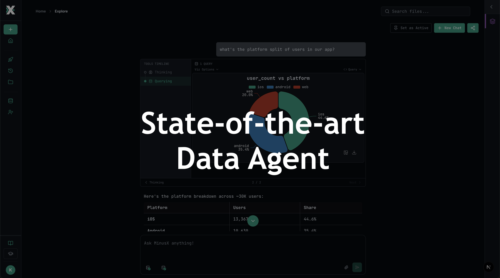
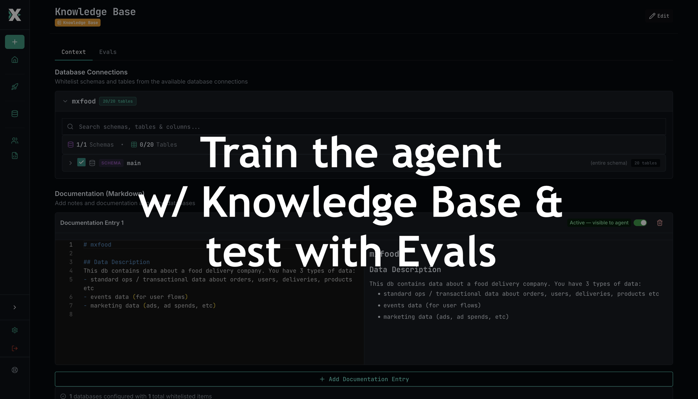

<div align="center" style="text-align: center;">


<!--  -->

MinusX is an open source agentic business intelligence platform for founders. <br>Your data stack, staffed by agents.


<h3>
  <a href="https://minusx.ai">Website</a>
  <span> · </span>
  <a href="https://docs.minusx.ai">Docs</a>
  <span> · </span>
  <!-- <a href="https://github.com/orgs/minusxai/projects/14">Roadmap</a>
  <span> · </span> -->
  <a href="https://minusx.app">Try MinusX Cloud</a>
</h3>

[](https://github.com/minusxai/minusx/actions/workflows/test.yml)
[](https://www.gnu.org/licenses/agpl-3.0)
[](https://x.com/minusxai)
[](https://minusx.ai/slack/)


MinusX OSS installation cmd: `curl -fsSL https://minusx.ai/install.sh | bash`
</div>

---

<table>
  <tr>
    <td></td>
    <td></td>
    <td></td>
  </tr>
</table>


## What you can do with MinusX

- **Explore naturally:** Ask ad-hoc questions in plain English across all your data
- **Move faster:** Use agents to dig through dashboards and questions, modify existing ones, or generate new ones
- **Be in control:** Tune agent performance and visibility using knowledge bases and evals
- **Know when things break:** Get proactive alerts when your metrics break, and have agents investigate the root cause across all your data and dashboards
- **Access from anywhere:** Use MinusX Slack bot or MCP integration to have your data at your fingertips, wherever you are

Note: This is on top of obvious BI features like connecting to databases/warehouses, questions, dashboards, reports, etc.


## Quick Start

```bash
curl -fsSL https://minusx.ai/install.sh | bash
```

Requires [Docker](https://docs.docker.com/get-docker/). The script checks for Docker, finds available ports, sets up your API keys, and starts the app.

## Local development
For local development, check out [Local Dev Setup](./LOCAL_DEV.md) guide.

## Why MinusX

We've spent years watching companies struggle with the same problem: they buy expensive "self-serve" BI tools, set it up over months, hire analysts, and build dashboards. And yet, most people in the company can't answer basic questions about their own data without pain and tears.

When LLMs got better, everyone (including us) bolted chatbots / text-to-SQL onto existing tools. Unfortunately, it doesn't work. These tools were designed around menus, isolated query editors and tons of scaffolding. The AI is an afterthought (a parlor trick almost) that breaks the moment you need it to do anything real. 


We built a state-of-the-art data agent that learns your business. And then built a BI platform around it. Learning from the magic of Claude Code, MinusX exposes the entire BI (questions, dashboards, reports etc.) as a file system the agent can read and write. The agent is omni-present, working exactly how you work.

Anyone who has spent any time working with LLMs in data knows that the hard part is not SQL, it's context. The model doesn't know that `revenue` is `ARR_operational` in your company, or that the `orders` table has a quirk where cancelled orders still show up, but only till 2025(!!!). MinusX Knowledge Base gives you tools to teach the agent what it needs to know, and learns from your continued usage. A 200 line generated SQL that you cannot understand, trust and reason about is as useless as not having the answer.

dbt is amazing. Semantic models are great. Still, less than ~10% of fast growing companies have all their data modeled. This tech-debt only grows as you scale. MinusX is designed to work with or without dbt. Write messy SQL and have the agent clean it up!


## License

[](https://www.gnu.org/licenses/agpl-3.0)

MinusX is Open Source Software and licensed under the AGPL-3.0 license. See [LICENSE](LICENSE) file for details.